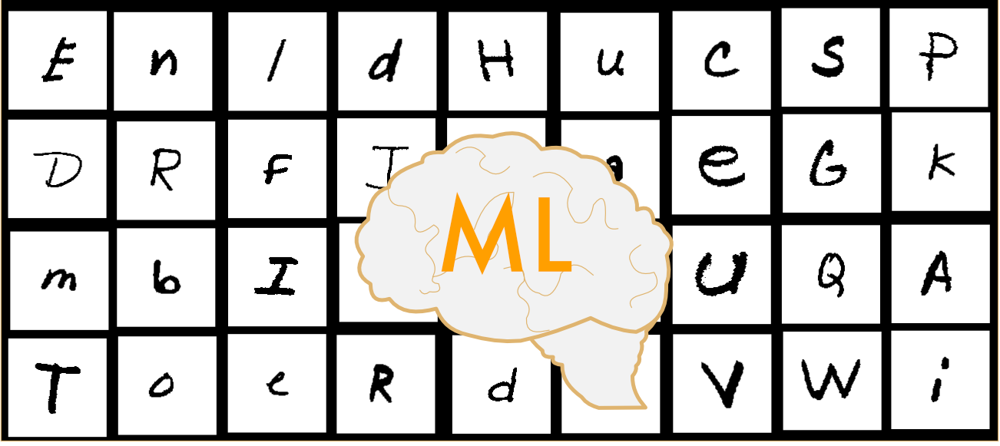
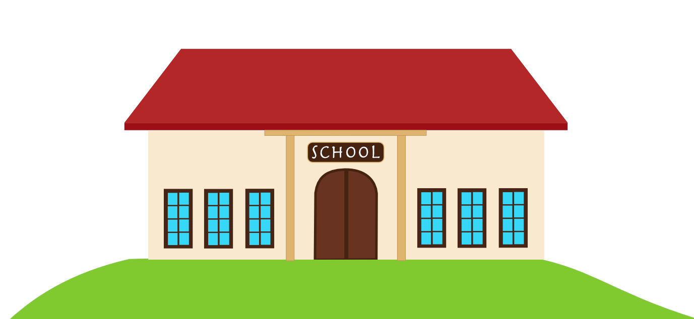
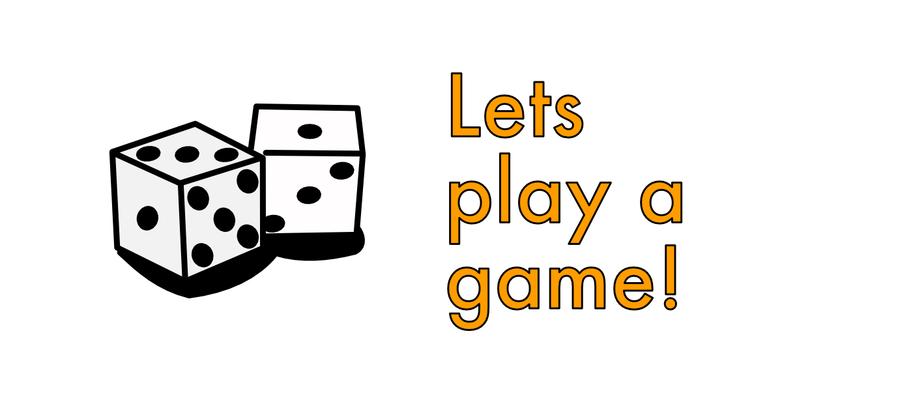

# wwdc-2019 
# About this PlaygroundBook

I wanted to show people the power of ML and explain that dyslexia is a real problem in the modern world. 

# The handwritting Machine learning (ML)
 
 In this playground, I used my ML model for handwritten letter recognizing.
 
 ## Maybe you don't know ML?
 
 "Machine learning (ML) is the scientific study of algorithms [...] to effectively perform a specific task without using explicit instructions, relying on patterns and inference instead." - [Wikipedia](https://en.wikipedia.org/wiki/Machine_learning)
 
 Basically, ML is a simple AI program that learns itself with a specific pattern. The big difference between ML and real AI is that ML learns once in training, than never again.
 
 about this Model:
 - 20 epoches
 - 32 filters
 - 2 Dropouts
 - input: 28x28px images
 
 ## How I trained:
 
 Create ML needs a lot of time, because it shows each image while it is trained. This makes it very slow. Not good.
 On the otherside Keras is console based, so it is really fast. The problem is that it is not easy to use.
 
 ## About the dataset:
 
 The emnist dataset is an extended version of the mnist dataset. The letter version of emnist provides 103k images in total, 88k for training and 14.8k for testing.

 # About dyslexia:
 
 Dyslexia is a problem which have 20% of all people, I´m one of them. the biggest problems are in school. The most common problem is that the people with dyslexia spell like they hear the words, but you know that it is often not the case. People with this problem can get in a lot of trouble in jobs or in school. I want to show you how hard it can be to bead dylexia.
 
 I am focusing on 2 problem:
 - the problem of similar letters (d - b,q - p,n - m, e - i, k - g)
 - ignoreing letters
 
  # The Dolch word list
 
 The Dolch word list is a list of words which contains the most misspelled englisch words of people with dyslexia.
 Mr. Dolch searched this words in every book about dyslexia and created this list.
 [Link to List](http://www.dyslexiavictoriaonline.com/dolch-spelling-words-and-dyslexics/)
 
 some words from the list:
 
 - upon
 - did
 - up
 - egg
 - see
 - wwdc
 - made
 - put
 - good
 - on
 - in
 - apple
 
 
 # About the game 
 
  Find the correct word. The programm is randomly picking an word that is hard to learn for kids with dyslexia.
 The game shows you how many letters the word has. If the letter is correct than it appears at it´s positíon.
 If a word contains one letter twice, the letter will apeare at too positions.
 You can play the game in dylexia mode or in "normal" mode. The dyslexia mode make is a bit tricker 😁.
 In this mode you need to make the same mistakes witch a person with dyslexia makes (don´t worry only the similar letter mistake).
 
 The programm is counting how many mistakes you make. So you can compare it each time, or with friends.
